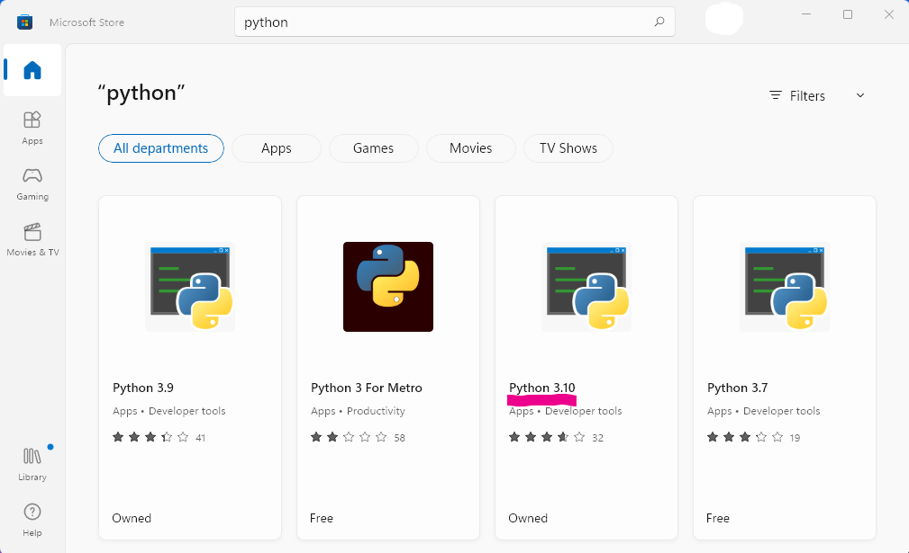

## Git Installation
Either install the `Github desktop client` or:

https://git-scm.com/download/win

## Python Installation
If you don't have Python already you can fetch it easily from the Windows Store. Simply type `store` into the windows search bar, and select the latest version. At the time of writing that is Python 3.10.

If you install Python straight from `python.org` instead remember to click 'Add Python environmental variables', this is important.

Once you have Python and Git for Windows installed you can simply download the source files (zip) directly with the green `Code` button, once extracted enter the directory and then from Powershell, `pip install .`

Now in Powershell use command `python .` or `pythonw .`
