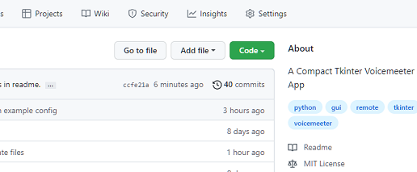
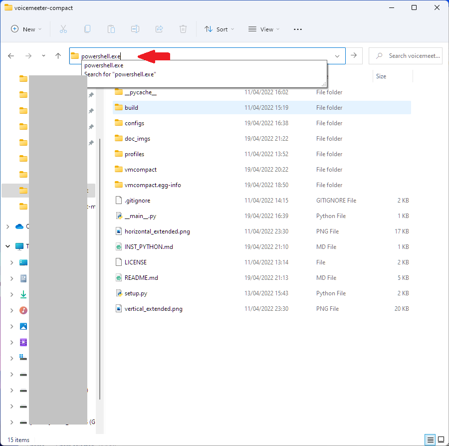

## Git Installation
https://git-scm.com/download/win

## Python Installation
If you don't have Python already you can fetch it easily from the Windows Store. Simply type `store` into the windows search bar, and select the latest version. At the time of writing that is Python 3.10.

If you install Python straight from `python.org` instead remember to click 'Add Python environmental variables', this is important.

Once you have Python and Git for Windows installed you can simply download the source files (zip) directly with the green `Code` button,

Once extracted enter voicemeeter-compact directory and type `powershell.exe` into the explorer bar as shown in the image below.

This will open a Powershell in the current directory.

Then use the command `pip install .` and wait for the required packages to install.

Finally, run the GUI with the command `python .` or `pythonw .`

If the GUI looks like the image below when you first load it, then no channels are labelled. From the menu, Profiles->Load Profile you may load an example config. Save your current Voicemeeter settings first :).

