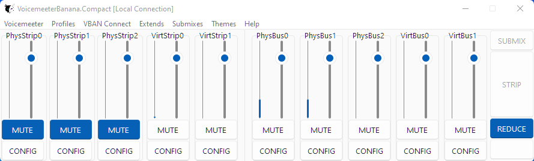
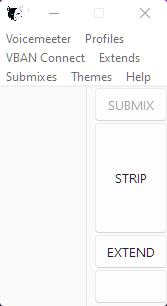

[](https://github.com/onyx-and-iris/voicemeeter-compact/blob/main/LICENSE)
[](https://github.com/psf/black)


# Voicemeeter Compact
## Prerequisites
- Voicemeeter 1 (Basic), 2 (Banana) or 3 (Potato)
- Python 3.9+


## Installation
```
git clone https://github.com/onyx-and-iris/voicemeeter-compact
cd voicemeeter-compact
pip install .
```

## Usage
Example `__main__.py` file:
```python
import voicemeeter
import vmcompact


def main():
    # pass the kind_id and the vmr object to the app
    with voicemeeter.remote(kind_id) as vmr:
        app = vmcompact.connect(kind_id, vmr)
        app.mainloop()


if __name__ == "__main__":
    # choose the kind of Voicemeeter (Local connection)
    kind_id = "banana"

    voicemeeter.launch(kind_id, hide=False)

    main()
```


It's important to know that only labelled strips and buses will appear in the Channel frames. Removing a Channels label will cause the GUI to grow/shrink in real time.



If the GUI looks like the above when you first load it, then no channels are labelled. From the menu, `Profiles->Load Profile` you may load an example config. Save your current Voicemeeter settings first :).

## Config Files
The following config files should be placed in the same directory as your `__main__.py`.

### app.toml
Configure certain startup states for the app.
- `theme`
By default the app loads up the [Sun Valley light or dark theme](https://github.com/rdbende/Sun-Valley-ttk-theme) by @rdbende. When all 16 channels for Potato are labelled you may find the app becomes slower so you have the option to load up the app without any theme loaded. Simply set `enabled` to false and `mode` will take no effect.

- `extends`
Extending the app will show both strips and buses. In reduced mode only one or the other. This app will extend both horizontally and vertically, simply set `extends_horizontal` true or false accordingly.

- `channel`
For each channel labelframe the width and height may be adjusted which effects the spacing between widgets and the length of the scales and progressbars respectively.

- `mwscroll_step`
Sets the amount (in db) the gain slider moves with a single mousewheel step. Default 3.

- `submixes`
Select the default submix bus when Submix frame is shown. For example, a dedicated bus for OBS.

### vban.toml
Configure as many vban connections as you wish. This allows the app to work over a LAN connection as well as with a local Voicemeeter installation. If you don't wish to use any vban connections I advise you to delete this file.

For vban connections to work correctly VBAN TEXT incoming stream MUST be configured correctly on the remote machine. Both pcs ought to be connected to a local private network and should be able to ping one another.

## Profiles
Three example profiles are included with the package, one for each kind of Voicemeeter. Use these to configure parameter startup states. Any parameter supported by the underlying interfaces may be used. For a detailed description of parameter coverage see:

[Voicemeeter Remote API Python](https://github.com/onyx-and-iris/voicemeeter-api-python)

[VBAN CMD API Python](https://github.com/onyx-and-iris/vban-cmd-python)

Profiles may be loaded at any time via the menu.

## Special Thanks
[Vincent Burel](https://github.com/vburel2018) for creating Voicemeeter, its SDK, the C Remote API and Streamer View app!

[Christian Volkmann](https://github.com/chvolkmann/voicemeeter-remote-python) for the detailed work that went into creating the underlying Remote API Python Interface.
Unfortunately, the Remote API Python Interface has `NOT` been open source licensed. I have raised an issue and asked directly and politely but so far no response. If a license is added in future I will update this section. Without an open source license there is no guarantee that in future this package may not be pulled down, without any notice.

[Rdbende](https://github.com/rdbende) for creating the beautiful Sun Valley Tkinter theme.
