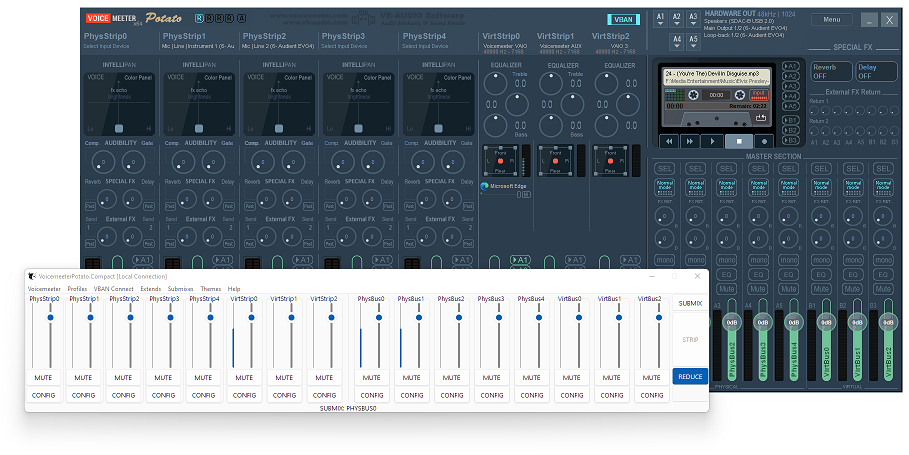
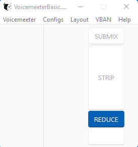

[](https://badge.fury.io/py/voicemeeter-compact)
[](https://github.com/onyx-and-iris/voicemeeter-compact/blob/main/LICENSE)
[](https://python-poetry.org/)
[](https://github.com/psf/black)




# Voicemeeter Compact

A compact Voicemeeter remote app, works locally and over LAN.

For an outline of past/future changes refer to: [CHANGELOG](CHANGELOG.md)

## Prerequisites

-   [Voicemeeter](https://voicemeeter.com/) (Basic v1.0.8.4), (Banana v2.0.6.4) or (Potato v3.0.2.4)
-   Python 3.10 or greater

## Installation

For a step-by-step guide [click here](INSTALLATION.md)

```
pip install voicemeeter-compact
```

## Usage

Example `__main__.py` file:

```python
import voicemeeterlib
import vmcompact


def main():
    # choose the kind of Voicemeeter (Local connection)
    KIND_ID = "banana"

    # pass the KIND_ID and the vm object to the app
    with voicemeeterlib.api(KIND_ID) as vm:
        app = vmcompact.connect(KIND_ID, vm)
        app.mainloop()


if __name__ == "__main__":
    main()
```

It's important to know that only labelled strips and buses will appear in the Channel frames. Removing a Channels label will cause the GUI to grow/shrink in real time.



If the GUI looks like the above when you first load it, then no channels are labelled. From the menu, `Configs->Load config` you may load an example config. Save your current Voicemeeter settings first :).

### KIND_ID

Set the kind of Voicemeeter, KIND_ID may be:

-   `basic`
-   `banana`
-   `potato`

## TOML Files

This is how your files should be organised. Wherever your `__main__.py` file is located (after install this can be any location), `configs` should be in the same location.
Directly inside of configs directory you may place an app.toml, vban.toml and a directory for each kind.
Inside each kind directory you may place as many custom toml configurations as you wish.

.

├── `__main__.py`

├── configs

&nbsp;&nbsp;&nbsp;&nbsp;&nbsp;&nbsp;&nbsp;&nbsp;├── app.toml

&nbsp;&nbsp;&nbsp;&nbsp;&nbsp;&nbsp;&nbsp;&nbsp;├── vban.toml

&nbsp;&nbsp;&nbsp;&nbsp;&nbsp;&nbsp;&nbsp;&nbsp;├── basic

&nbsp;&nbsp;&nbsp;&nbsp;&nbsp;&nbsp;&nbsp;&nbsp;&nbsp;&nbsp;&nbsp;&nbsp;&nbsp;&nbsp;&nbsp;&nbsp;├── example.toml

&nbsp;&nbsp;&nbsp;&nbsp;&nbsp;&nbsp;&nbsp;&nbsp;&nbsp;&nbsp;&nbsp;&nbsp;&nbsp;&nbsp;&nbsp;&nbsp;├── other_config.toml

&nbsp;&nbsp;&nbsp;&nbsp;&nbsp;&nbsp;&nbsp;&nbsp;&nbsp;&nbsp;&nbsp;&nbsp;&nbsp;&nbsp;&nbsp;&nbsp;├── streaming_config.toml

&nbsp;&nbsp;&nbsp;&nbsp;&nbsp;&nbsp;&nbsp;&nbsp;├── banana

&nbsp;&nbsp;&nbsp;&nbsp;&nbsp;&nbsp;&nbsp;&nbsp;&nbsp;&nbsp;&nbsp;&nbsp;&nbsp;&nbsp;&nbsp;&nbsp;├── example.toml

&nbsp;&nbsp;&nbsp;&nbsp;&nbsp;&nbsp;&nbsp;&nbsp;&nbsp;&nbsp;&nbsp;&nbsp;&nbsp;&nbsp;&nbsp;&nbsp;├── other.toml

&nbsp;&nbsp;&nbsp;&nbsp;&nbsp;&nbsp;&nbsp;&nbsp;&nbsp;&nbsp;&nbsp;&nbsp;&nbsp;&nbsp;&nbsp;&nbsp;├── ...

&nbsp;&nbsp;&nbsp;&nbsp;&nbsp;&nbsp;&nbsp;&nbsp;├── potato

&nbsp;&nbsp;&nbsp;&nbsp;&nbsp;&nbsp;&nbsp;&nbsp;&nbsp;&nbsp;&nbsp;&nbsp;&nbsp;&nbsp;&nbsp;&nbsp;├── example.toml

&nbsp;&nbsp;&nbsp;&nbsp;&nbsp;&nbsp;&nbsp;&nbsp;&nbsp;&nbsp;&nbsp;&nbsp;&nbsp;&nbsp;&nbsp;&nbsp;├── ...

## Configs

### app.toml

Configure certain startup states for the app.

-   `configs`
    Configure a user config to load on app startup. Don't include the .toml extension in the config name.

-   `theme`
    By default the app loads up the [Sun Valley light or dark theme](https://github.com/rdbende/Sun-Valley-ttk-theme) by @rdbende. You have the option to load up the app without any theme loaded. Simply set `enabled` to false and `mode` will take no effect.

-   `extends`
    Extending the app will show both strips and buses. In reduced mode only one or the other. This app will extend both horizontally and vertically, simply set `extends_horizontal` true or false accordingly.

-   `channel`
    For each channel labelframe the width and height may be adjusted which effects the spacing between widgets and the length of the scales and progressbars respectively.

-   `mwscroll_step`
    Sets the amount (in db) the gain slider moves with a single mousewheel step. Default 3.

-   `submixes`
    Select the default submix bus when Submix frame is shown. For example, a dedicated bus for OBS.

### vban.toml

Configure as many vban connections as you wish. This allows the app to work over a LAN connection as well as with a local Voicemeeter installation.

For vban connections to work correctly VBAN TEXT incoming stream MUST be configured correctly on the remote machine. Both pcs ought to be connected to a local private network and should be able to ping one another.

A valid `vban.toml` might look like this:

```toml
[connection-1]
kind = 'banana'
ip = '192.168.1.2'
streamname = 'worklaptop'
port = 6980

[connection-2]
kind = 'potato'
ip = '192.168.1.3'
streamname = 'streampc'
port = 6990
```

### basic/ banana/ potato/

Three example user configs are included with the package, one for each kind of Voicemeeter. Use these to configure parameter startup states. Any parameter supported by the underlying interfaces may be used. Check the 'multiple-parameters' section for more info:

[Python Interface for Voicemeeter API](https://github.com/onyx-and-iris/voicemeeter-api-python#multiple-parameters)

[Python Interface for VBAN CMD](https://github.com/onyx-and-iris/vban-cmd-python#multiple-parameters)

User configs may be loaded at any time via the menu.

## Special Thanks

[Vincent Burel](https://github.com/vburel2018) for creating Voicemeeter, its SDK, the C Remote API, the RT Packet service and Streamer View app!

[Rdbende](https://github.com/rdbende) for creating the beautiful Sun Valley Tkinter theme and adding it to Pypi!
